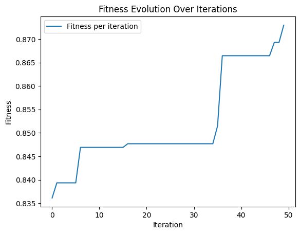
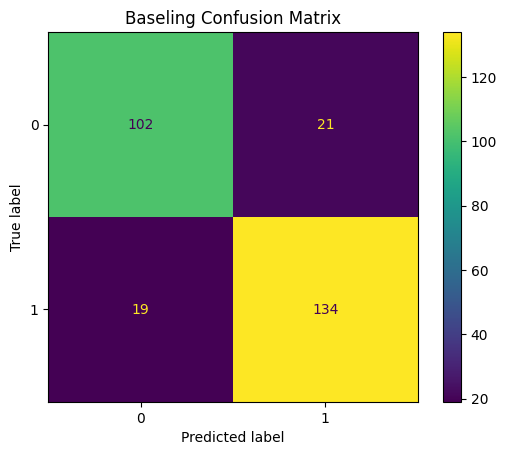

# Evolutionary SVM Kernel Selection

A personal project implementing evolutionary algorithms to optimize polynomial kernel parameters for Support Vector Machines.

## Overview

This project uses evolutionary algorithms to evolve optimal polynomial kernel coefficients for an SVM classifier. The algorithm:
- Maintains a population of polynomial kernel configurations (coefficient sets)
- Evolves them through selection, crossover, and mutation
- Evaluates fitness based on F1 score (99%) and training time (1%)

**Dataset**: [Heart Failure Prediction](https://www.kaggle.com/datasets/fedesoriano/heart-failure-prediction) from Kaggle

**Note**: This implementation shows no significant performance improvements over standard kernels and was created without consulting relevant literature.

## Results

### Fitness Evolution
The algorithm converges to optimal kernel parameters over 50 iterations:

### Performance Comparison
Comparing the evolved kernel against sklearn's standard polynomial kernel:

| Evolved Kernel | Baseline Kernel |
|:---:|:---:|
|  |  |

## Implementation Details

- **Population Size**: 40 individuals
- **Max Polynomial Degree**: 4
- **Coefficient Range**: ±40
- **Mutation Rate**: 5%
- **Selection**: 75% fitness-weighted, 25% random (for diversity)
- **Elitism**: Best individual always preserved

## Files

- `EvolutionarySVM.ipynb` - Main notebook with implementation and experiments
